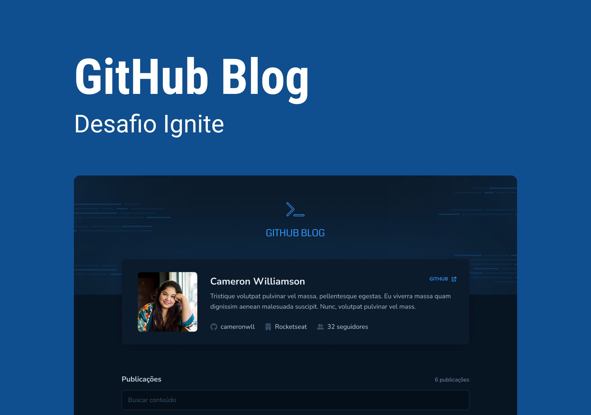

  

## Application developed to train my knowledge about performance and API in React

---

## 🎥 Preview

### How project works 💻

 

---

## 📚 Learning

All the things that I learned and practiced with this project

- I learn `performance` to improve the website
- I learn `how to handle with API` in React

 

---

## 🧪 Technologies

This project was developed using de following technologies:

- [React](https://react.dev/)
- [Typescript](https://www.typescriptlang.org/)
- [Fontawesome Icons](https://fontawesome.com/)
- [Axios](https://axios-http.com/ptbr/)
- [Date fns](https://date-fns.org/)
- [React markdown](https://remarkjs.github.io/react-markdown/)
- [Styled components](https://styled-components.com/)
- [React router dom](https://reactrouter.com/en/main)

 

---

## 🔖 Layout

You can view the project layout through the links below:

- [Layout](https://www.figma.com/community/file/1138814951106121051)

Remembering that you need to have a [Figma](http://figma.com/) account to access it.

 

---

Developed by [ricardorhv](https://github.com/ricardorhv) 👋
